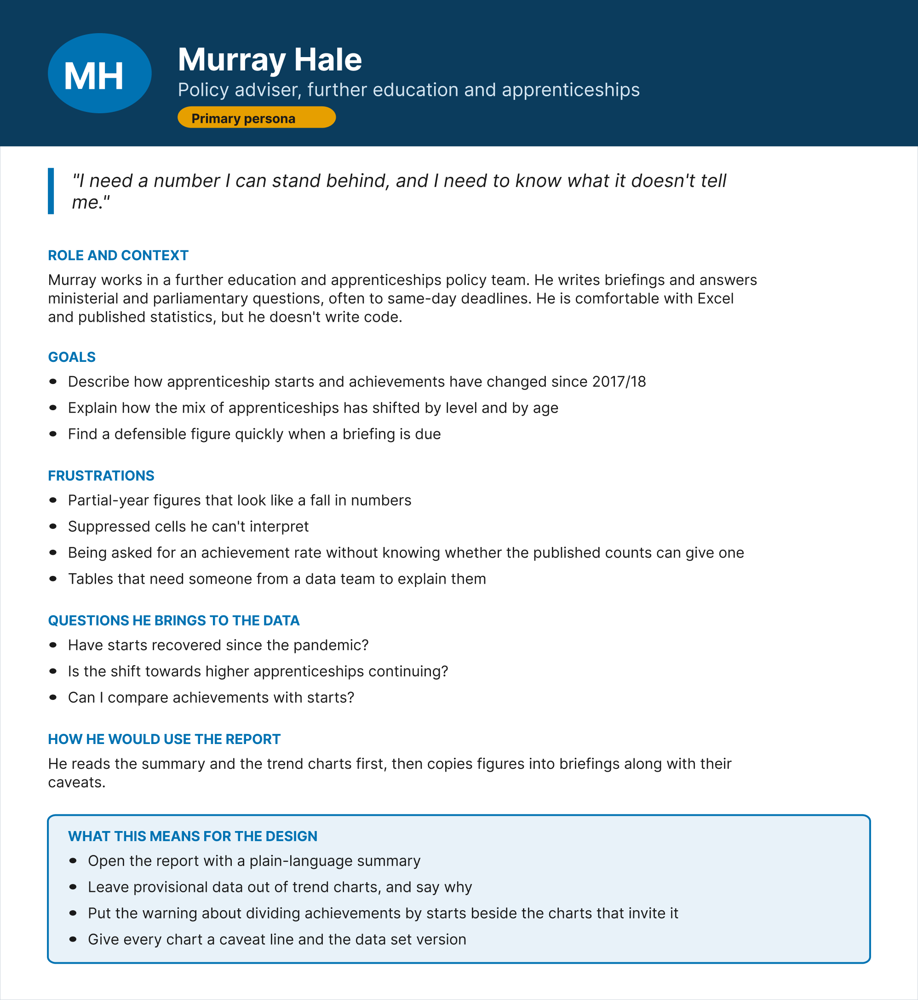
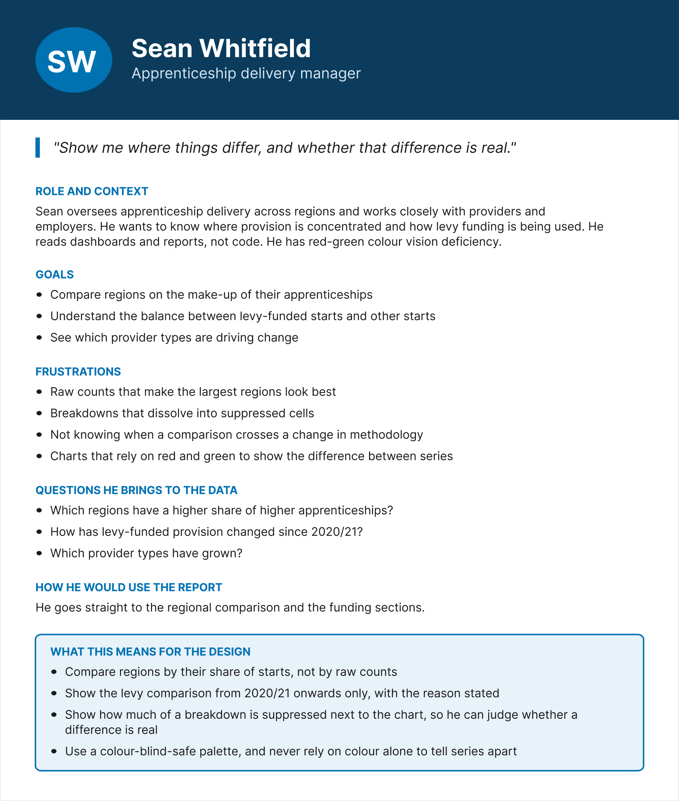
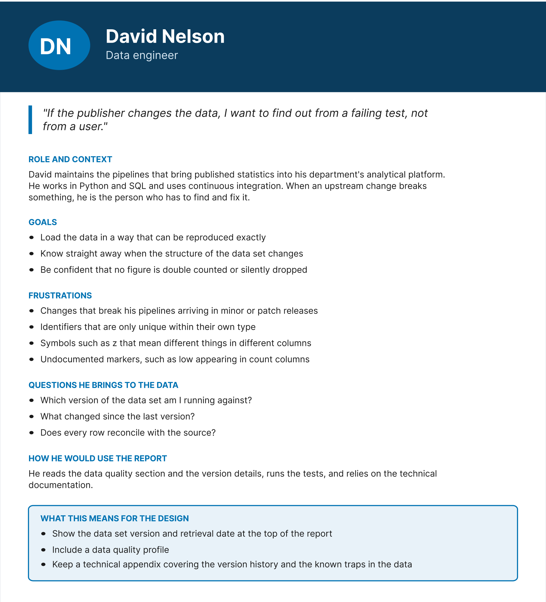
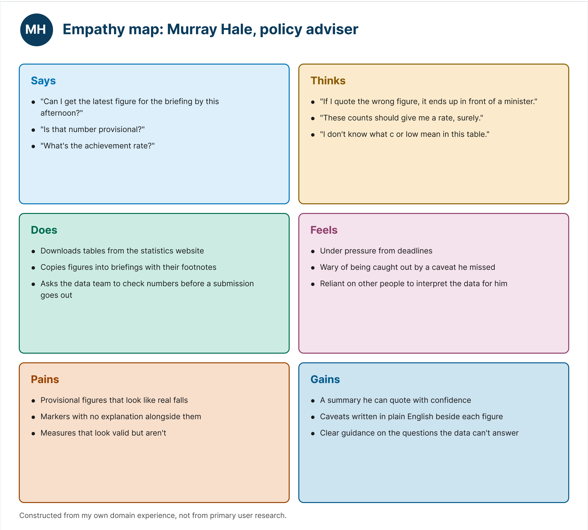

# Personas and empathy map

For this design task, I worked from a simulated research scenario. The personas draw on my own experience of working with apprenticeship and further education data. Their purpose is to keep the design of the report focused on the questions real users bring to the data.

The editable designs are in Figma: https://www.figma.com/design/tN8jW4cdfJyDCgD4W03aZT/Apprenticeship-Data-Pipeline-Explorer--design?m=auto&t=ffuH1oBgg55d92nT-6

---

## Murray Hale, policy adviser (primary persona)

**Role and context**

Murray works in a further education and apprenticeships policy team. He writes briefings and answers ministerial and parliamentary questions, often to same-day deadlines. He is comfortable with Excel and published statistics, but he doesn't write code.

**In his words**

"I need a number I can stand behind, and I need to know what it doesn't tell me."

**Goals**

- Describe how apprenticeship starts and achievements have changed since 2017/18
- Explain how the mix of apprenticeships has shifted by level and by age
- Find a defensible figure quickly when a briefing is due

**Frustrations**

- Partial-year figures that look like a fall in numbers
- Suppressed cells he can't interpret
- Being asked for an achievement rate without knowing whether the published counts can give one
- Tables that need someone from a data team to explain them

**Questions he brings to the data**

- Have starts recovered since the pandemic?
- Is the shift towards higher apprenticeships continuing?
- Can I compare achievements with starts?

**How he would use the report**

He reads the summary and the trend charts first, then copies figures into briefings along with their caveats.

**What this means for the design**

- Open the report with a plain-language summary
- Leave provisional data out of trend charts, and say why
- Put the warning about dividing achievements by starts beside the charts that invite it
- Give every chart a caveat line and the data set version

---

## Sean Whitfield, apprenticeship delivery manager

**Role and context**

Sean oversees apprenticeship delivery across regions and works closely with providers and employers. He wants to know where provision is concentrated and how levy funding is being used. He reads dashboards and reports, not code. He has red-green colour vision deficiency.

**In his words**

"Show me where things differ, and whether that difference is real."

**Goals**

- Compare regions on the make-up of their apprenticeships
- Understand the balance between levy-funded starts and other starts
- See which provider types are driving change

**Frustrations**

- Raw counts that make the largest regions look best
- Breakdowns that dissolve into suppressed cells
- Not knowing when a comparison crosses a change in methodology
- Charts that rely on red and green to show the difference between series

**Questions he brings to the data**

- Which regions have a higher share of higher apprenticeships?
- How has levy-funded provision changed since 2020/21?
- Which provider types have grown?

**How he would use the report**

He goes straight to the regional comparison and the funding sections.

**What this means for the design**

- Compare regions by their share of starts, not by raw counts
- Show the levy comparison from 2020/21 onwards only, with the reason stated
- Show how much of a breakdown is suppressed next to the chart, so he can judge whether a difference is real
- Use a colour-blind-safe palette, and never rely on colour alone to tell series apart

---

## David Nelson, data engineer

**Role and context**

David maintains the pipelines that bring published statistics into his department's analytical platform. He works in Python and SQL and uses continuous integration. When an upstream change breaks something, he is the person who has to find and fix it.

**In his words**

"If the publisher changes the data, I want to find out from a failing test, not from a user."

**Goals**

- Load the data in a way that can be reproduced exactly
- Know straight away when the structure of the data set changes
- Be confident that no figure is double counted or silently dropped

**Frustrations**

- Changes that break his pipelines arriving in minor or patch releases
- Identifiers that are only unique within their own type
- Symbols such as `z` that mean different things in different columns
- Undocumented markers, such as `low` appearing in count columns

**Questions he brings to the data**

- Which version of the data set am I running against?
- What changed since the last version?
- Does every row reconcile with the source?

**How he would use the report**

He reads the data quality section and the version details, runs the tests, and relies on the technical documentation.

**What this means for the design**

- Show the data set version and retrieval date at the top of the report
- Include a data quality profile
- Keep a technical appendix covering the version history and the known traps in the data

---

## Empathy map: Murray Hale

**Says**

- "Can I get the latest figure for the briefing by this afternoon?"
- "Is that number provisional?"
- "What's the achievement rate?"

**Thinks**

- "If I quote the wrong figure, it ends up in front of a minister."
- "These counts should give me a rate, surely."
- "I don't know what c or low mean in this table."

**Does**

- Downloads tables from the statistics website
- Copies figures into briefings with their footnotes
- Asks the data team to check numbers before a submission goes out

**Feels**

- Under pressure from deadlines
- Wary of being caught out by a caveat he missed
- Reliant on other people to interpret the data for him

**Pains**

- Provisional figures that look like real falls
- Markers with no explanation alongside them
- Measures that look valid but aren't

**Gains**

- A summary he can quote with confidence
- Caveats written in plain English beside each figure
- Clear guidance on the questions the data can't answer

---

## Review of the user stories against the personas

**Sprint 1 issues still to build**

| Issue | Persona it serves | Change |
|---|---|---|
| #4 Time period normaliser | David | None |
| #5 Metadata model with namespaced identifiers | David | None |
| #6 Single-cell selector to prevent double counting | Murray | None |
| #7 Analysis window filter | Murray | None |
| #9 API client for data set endpoints | David | None |

**Sprint 2 backlog**

| Backlog item | Persona it serves | Change |
|---|---|---|
| Level and age mix metrics | Murray, Sean | The funding type comparison from 2020/21 becomes a requirement, because Sean needs it. It was previously optional. |
| Regional comparison by within-region share | Sean | None |
| Data quality profile | David, Sean | Sean added, because he needs to judge whether a regional difference is real |
| Accessible charts | Sean | User story reworded around Sean's red-green colour vision deficiency |
| All other items | Murray or David | None |