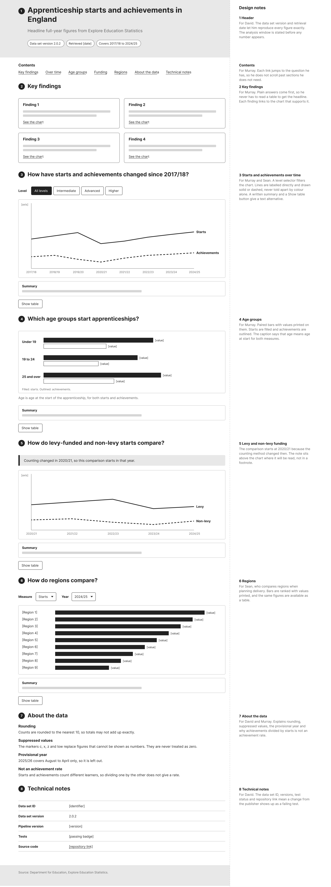
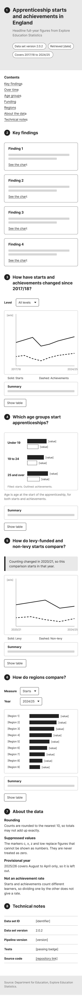
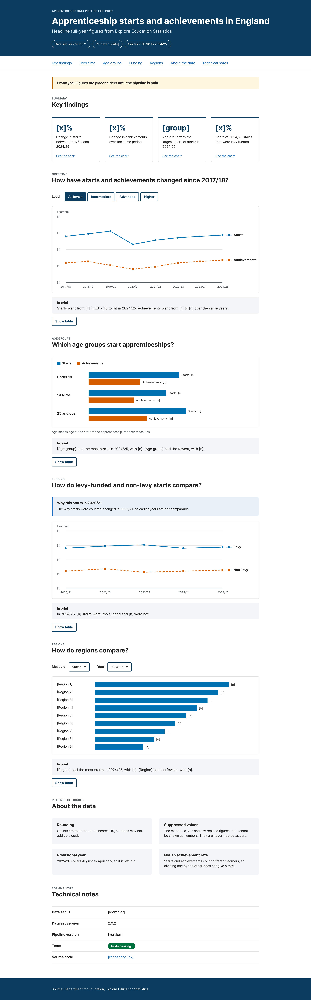


# Wireframes and prototype

This document covers the design of the analysis report, from low-fidelity wireframes to two versions of a high-fidelity prototype. Version 2 applies the changes from a persona-based review of version 1.

The editable designs are in Figma: https://www.figma.com/design/tN8jW4cdfJyDCgD4W03aZT/Apprenticeship-Data-Pipeline-Explorer--design?node-id=10-761&t=9bSUVDfXfVVJO6AR-0

The figures in the prototype are placeholders, shown as `[n]` and `[x]%`, because the pipeline that produces them is not built yet. The shapes of the charts are illustrative and are not findings.

---

## Low-fidelity wireframes

I laid the report out around the questions its users bring to the data, in this order:

1. Header, with the data set version, retrieval date and analysis window
2. Key findings, in plain language
3. How starts and achievements have changed since 2017/18
4. Which age groups start apprenticeships
5. How levy-funded and non-levy starts compare, from 2020/21
6. How regions compare
7. About the data
8. Technical notes

The desktop wireframe has a design notes column, which records the persona each section serves and why it is there. The mobile wireframe checks that the same order still works in a single column.

---

## Prototype version 1

Version 1 turns the wireframe into a high-fidelity design with real typography, colour and components.

---

## Persona-based review of version 1

Following the simulated research scenario, I reviewed version 1 by walking through it as each persona. I checked each section against the persona's goals, frustrations and the design needs on their card in [personas.md](personas.md). Each finding below led to a change in version 2, apart from the two marked as no change.

| Ref | Persona | Finding in version 1 | Change in version 2 |
|---|---|---|---|
| R1 | Murray | The warning about dividing achievements by starts was only in About the data. The over time and age charts show both measures side by side, which invites that division. | A warning box sits directly above both charts. |
| R2 | Murray | No chart carried its own caveat line or the data set version, so a figure copied into a briefing lost its context. | Every chart has a caveat line with the source, the data set version and the rounding. |
| R3 | Murray | The trend chart left out 2025/26 without saying why, so the reason was easy to miss. | The caveat line under the trend chart states that 2025/26 covers August to April only. |
| R4 | Murray | He asks whether the shift towards higher apprenticeships is continuing. The level buttons show one level at a time, so they cannot show the mix. | A new chart shows each level's share of all starts over time. A key finding on the higher level share replaces the change in achievements. |
| R5 | Murray, David | The axis said "Learners", but the figures count starts and achievements, and one learner can start more than once. | Axis titles now name the measure, such as "Number of starts and achievements". |
| R6 | Sean | Regions were ranked by raw counts, which makes the largest regions look best. | Regions are compared by the share of each region's starts at higher level, with the reason stated under the chart. |
| R7 | Sean | Nothing showed how much of a breakdown was suppressed, so he could not judge whether a difference was real. | The age and regional charts state how many cells are suppressed. A suppressed region is shown as suppressed, not as an empty bar. |
| R8 | David | There was no data quality profile. | About the data now includes a profile of rows loaded, rows that reconcile with the source, suppressed cells by marker and subtotal rows left out. |
| R9 | David | Technical notes had no version history and no record of the known traps in the data. | Technical notes now link to the version history and list the known traps. |
| No change | Sean | The blue and vermillion palette with solid and dashed lines, marker shapes and direct labels worked without relying on colour. | None |
| No change | David | The data set version and retrieval date were already at the top of the report. | None |

---

## Prototype version 2

---

## Accessibility

I designed accessibility in from the wireframe stage rather than adding it at the end.

- **Colour-blind-safe palette.** The two main series use Okabe-Ito blue `#0072B2` and vermillion `#D55E00`, which stay distinct with red-green colour vision deficiency.
- **No meaning from colour alone.** Every series also differs by line style and marker shape, and is labelled directly at the end of its line. Every bar prints its measure and value.
- **Text alternatives for charts.** Each chart has an "In brief" sentence and a Show table button, which gives the same figures as a table.
- **Contrast.** I checked every text colour against its background with the WCAG 2.2 formula. All text is at least 4.5:1, and both chart colours are above the 3:1 minimum for graphics, at 5.19:1 and 3.87:1.